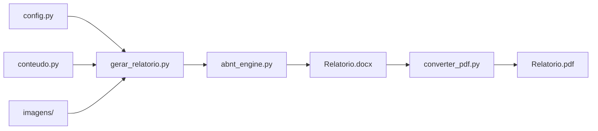

[](#licença)
[](CHANGELOG.md)
[](requirements.txt)
[](https://www.abnt.org.br/)

# RelatorioABNT

Gerador de relatórios acadêmicos em **DOCX** no padrão **ABNT** (NBR 14724), configurado por arquivos Python — sem editar Word manualmente do zero.

Ideal para trabalhos de **qualquer disciplina**: laboratório de química, programação, engenharia, biologia, física, etc. Você descreve o conteúdo em `conteudo.py`, define capa e sumário em `config.py`, e o script monta capa, folha de rosto, sumário, seções, figuras, quadros e referências.

---

## Índice

- [Por que usar](#por-que-usar)
- [Funcionalidades](#funcionalidades)
- [Requisitos](#requisitos)
- [Instalação](#instalação)
- [Início rápido](#início-rápido)
- [Como funciona](#como-funciona)
- [Estrutura do repositório](#estrutura-do-repositório)
- [Criando um novo relatório](#criando-um-novo-relatório)
- [Referência: `config.py`](#referência-configpy)
- [Referência: `conteudo.py`](#referência-conteudopy)
- [Tipos de bloco](#tipos-de-bloco)
- [CLI — linha de comando](#cli--linha-de-comando)
- [Exemplos incluídos](#exemplos-incluídos)
- [Formatação ABNT aplicada](#formatação-abnt-aplicada)
- [Solução de problemas](#solução-de-problemas)
- [Contribuindo](#contribuindo)
- [Licença](#licença)

---

## Por que usar

| Problema comum | Solução deste projeto |
|----------------|----------------------|
| Perder tempo formatando capa e margens no Word | Formatação ABNT aplicada automaticamente |
| Sumário com pontinhos desalinhados | Sumário com tab leaders gerado pelo motor |
| Copiar/colar código e figuras manualmente | Blocos declarativos (`codigo`, `imagem`, `quadro`) |
| Reaproveitar estrutura entre trabalhos | Copie `_template`, edite dois arquivos e gere de novo |
| Trabalho de química **e** de programação | Mesma ferramenta; só muda o conteúdo |

---

## Funcionalidades

- Capa e folha de rosto configuráveis
- Sumário com numeração de páginas estimada e subseções
- Texto corrido com recuo de parágrafo ABNT
- **Quadros** (tabelas com legenda e fonte)
- **Código-fonte** com fundo cinza e fonte monoespaçada
- **Imagens** — PNG, JPG, GIF, BMP, TIFF (fotos, gráficos, diagramas)
- **Figuras de texto** — saída de terminal ou trecho de `.txt`
- Subseções aninhadas (2.1, 3.2.1…)
- Considerações finais e referências com títulos configuráveis
- Exportação para **PDF** via Microsoft Word (`docx2pdf`)

---

## Requisitos

| Item | Obrigatório | Observação |
|------|-------------|------------|
| Python 3.10+ | Sim | Testado no Windows |
| `pip install -r requirements.txt` | Sim | `python-docx`, `docx2pdf` |
| Microsoft Word | Só para PDF | A geração do `.docx` não precisa do Word |
| LibreOffice | Alternativa | Abra o `.docx` e exporte PDF manualmente |

---

## Instalação

```bash
git clone https://github.com/danilofortes/RelatorioABNT.git
cd RelatorioABNT
pip install -r requirements.txt
```

Ou, se já tiver a pasta localmente:

```bash
cd RelatorioABNT
pip install -r requirements.txt
```

---

## Início rápido

**1. Gerar relatório de química (com imagens):**

```bash
python gerar_relatorio.py --projeto exemplos/quimica-titulacao
```

**2. Gerar relatório de programação em C:**

```bash
python gerar_relatorio.py --projeto exemplos/grupo15-jogos
```

**3. Converter para PDF (Windows + Word):**

```bash
python converter_pdf.py exemplos/quimica-titulacao/Relatorio_Quimica.docx
```

Saída esperada:

```
Relatorio gerado: .../Relatorio_Quimica.docx
PDF gerado: .../Relatorio_Quimica.pdf
```

---

## Como funciona



1. Você edita **`config.py`** (metadados, sumário, nome do arquivo).
2. Você edita **`conteudo.py`** (seções e blocos de conteúdo).
3. Opcionalmente adiciona arquivos em **`imagens/`**.
4. Roda `gerar_relatorio.py --projeto pasta-do-trabalho`.
5. Abre o `.docx` no Word para revisão final (ou converte para PDF).

---

## Estrutura do repositório

```
RelatorioABNT/
├── abnt_engine.py          # Motor de formatação ABNT (raramente precisa editar)
├── gerar_relatorio.py      # CLI: gera o .docx
├── converter_pdf.py        # CLI: converte .docx → .pdf
├── requirements.txt
├── CHANGELOG.md
├── README.md
└── exemplos/
    ├── _template/              # Copie para iniciar um projeto novo
    │   ├── config.py
    │   └── conteudo.py
    ├── quimica-titulacao/      # Laboratório: titulação ácido-base
    │   ├── config.py
    │   ├── conteudo.py
    │   ├── imagens/
    │   └── Relatorio_Quimica.docx   # (gerado)
    └── grupo15-jogos/          # Programação estruturada em C
        ├── config.py
        ├── conteudo.py
        └── Grupo15_Relatorio.docx   # (gerado)
```

**Arquivos que você cria por trabalho:**

```
meu-trabalho/
├── config.py       # Capa, autores, sumário
├── conteudo.py     # Texto, tabelas, código, imagens
└── imagens/        # Fotos e gráficos (opcional)
    ├── foto1.png
    └── grafico.png
```

---

## Criando um novo relatório

### Passo 1 — Copiar o template

```bash
cp -r exemplos/_template ../meu-trabalho
```

No Windows (PowerShell):

```powershell
Copy-Item -Recurse exemplos\_template ..\meu-trabalho
```

### Passo 2 — Editar `config.py`

Defina capa, autores, sumário e nome do arquivo de saída.

### Passo 3 — Editar `conteudo.py`

Monte as seções com blocos (`paragrafo`, `quadro`, `imagem`, etc.).

### Passo 4 — Adicionar imagens (se precisar)

Salve fotos/gráficos em `meu-trabalho/imagens/` e referencie com `"arquivo": "imagens/nome.png"`.

### Passo 5 — Gerar

```bash
python gerar_relatorio.py --projeto ../meu-trabalho
```

---

## Referência: `config.py`

### `METADADOS`

| Campo | Tipo | Descrição |
|-------|------|-----------|
| `instituicao_linhas` | `list[str]` | Linhas do topo da capa (universidade, curso…) |
| `autores` | `list[str]` | Nomes em maiúsculas |
| `grupo` | `str` | Ex.: `"GRUPO 15"` — use `""` se não aplicável |
| `titulo` | `str` | Título principal da capa |
| `subtitulo` | `str` | Subtítulo (itálico na capa) |
| `cidade` | `str` | Cidade no rodapé da capa |
| `ano` | `str` | Ano no rodapé |
| `nota_folha_rosto` | `str` | Texto da folha de rosto (recuo à direita) |
| `arquivo_saida` | `str` | Nome do `.docx` gerado |
| `espacos_antes_autores` | `int` | Opcional; padrão `6` |
| `espacos_antes_titulo` | `int` | Opcional; padrão `5` |
| `espacos_antes_local` | `int` | Opcional; padrão `8` |

**Exemplo:**

```python
METADADOS = {
    "instituicao_linhas": [
        "UNIVERSIDADE SÃO FRANCISCO",
        "QUÍMICA GERAL EXPERIMENTAL",
    ],
    "autores": ["MARIA SILVA", "JOÃO SANTOS"],
    "grupo": "GRUPO 3",
    "titulo": "RELATÓRIO DE PRÁTICA DE LABORATÓRIO",
    "subtitulo": "Titulação ácido-base: determinação da concentração de HCl",
    "cidade": "Campinas",
    "ano": "2026",
    "nota_folha_rosto": (
        "Relatório apresentado à disciplina de Química Geral Experimental "
        "como requisito parcial para avaliação."
    ),
    "arquivo_saida": "Relatorio_Quimica.docx",
}
```

### `TITULOS_FINAIS`

Controla o texto das últimas seções (inclua a numeração que bate com o sumário):

```python
TITULOS_FINAIS = {
    "consideracoes": "5 CONSIDERAÇÕES FINAIS",
    "referencias": "6 REFERÊNCIAS",
}
```

### `SUMARIO`

Lista de tuplas `(titulo, pagina)` ou `(titulo, pagina, nivel)`:

```python
def normalizar_sumario(itens):
    resultado = []
    for item in itens:
        if len(item) == 2:
            resultado.append({"titulo": item[0], "pagina": item[1], "nivel": 1})
        else:
            resultado.append({"titulo": item[0], "pagina": item[1], "nivel": item[2]})
    return resultado

SUMARIO = normalizar_sumario([
    ("1 INTRODUÇÃO", "4"),
    ("2.1 Reagentes e equipamentos", "5", 2),  # nível 2 = subseção
    ("5 CONSIDERAÇÕES FINAIS", "10"),
    ("6 REFERÊNCIAS", "11"),
])
```

> **Dica:** os números de página são estimativas. Após gerar o DOCX, confira no Word e ajuste o sumário se necessário.

---

## Referência: `conteudo.py`

Três variáveis principais:

| Variável | Conteúdo |
|----------|----------|
| `SECOES` | Lista de seções do corpo do trabalho |
| `CONSIDERACOES` | Lista de parágrafos das considerações finais |
| `REFERENCIAS` | Lista de referências no padrão ABNT |

**Estrutura de uma seção:**

```python
SECOES = [
    {
        "titulo": "1 INTRODUÇÃO",
        "blocos": [
            {"tipo": "paragrafo", "texto": "..."},
            # mais blocos...
        ],
        "quebra_pagina": True,  # opcional
    },
]
```

---

## Tipos de bloco

### `paragrafo`

Texto corrido com recuo ABNT.

```python
{"tipo": "paragrafo", "texto": "Texto corrido do relatório."}
```

---

### `quadro`

Tabela com legenda acima e fonte abaixo.

```python
{
    "tipo": "quadro",
    "legenda": "Quadro 1 - Reagentes utilizados",
    "cabecalhos": ["Reagente", "Concentração", "Função"],
    "linhas": [
        ["HCl", "Desconhecida", "Analito"],
        ["NaOH", "0,1 mol/L", "Titulante"],
    ],
    "fonte": "Fonte: elaborado pelos autores (2026).",
}
```

---

### `imagem`

Foto, gráfico ou diagrama. Caminho **relativo à pasta do projeto**.

```python
{
    "tipo": "imagem",
    "paragrafo_antes": "Montagem do experimento:",
    "legenda": "Figura 1 - Bureta e Erlenmeyer",
    "arquivo": "imagens/montagem_bureta.png",
    "largura_cm": 12,       # opcional; padrão 14
    "altura_cm": None,      # opcional; omita para manter proporção
    "fonte": "Fonte: registro do laboratório (2026).",
}
```

**Formatos:** PNG, JPG, JPEG, GIF, BMP, TIFF.

---

### `figura`

Dois modos:

**Modo texto** — saída de terminal ou trecho de arquivo:

```python
{
    "tipo": "figura",
    "paragrafo_antes": "Saída do terminal:",
    "legenda": "Figura 2 - Execução do programa",
    "conteudo": "Arquivo gerado com sucesso!\n100 registros salvos.",
    "fonte": "Fonte: captura de execução (2026).",
}
```

**Modo imagem** — equivalente a `imagem`:

```python
{
    "tipo": "figura",
    "legenda": "Figura 3 - Gráfico experimental",
    "arquivo": "imagens/grafico.png",
    "fonte": "Fonte: elaborado pelos autores (2026).",
}
```

---

### `codigo`

Trecho de código com legenda e fonte.

```python
{
    "tipo": "codigo",
    "paragrafo_antes": "A função principal do programa:",
    "legenda": "Código 1 - Função main",
    "codigo": (
        "int main(void) {\n"
        "    printf(\"Hello\");\n"
        "    return 0;\n"
        "}"
    ),
    "fonte": "Fonte: código-fonte do projeto (2026).",
}
```

---

### `subsecao`

Agrupa blocos dentro de uma seção (2.1, 3.2…).

```python
{
    "tipo": "subsecao",
    "titulo": "2.1 Reagentes e equipamentos",
    "nivel": 2,
    "blocos": [
        {"tipo": "paragrafo", "texto": "..."},
        {
            "tipo": "imagem",
            "legenda": "Figura 1 - ...",
            "arquivo": "imagens/foto.png",
            "fonte": "Fonte: ...",
        },
    ],
}
```

---

## CLI — linha de comando

### `gerar_relatorio.py`

| Argumento | Padrão | Descrição |
|-----------|--------|-----------|
| `--projeto` | `.` (pasta atual) | Pasta com `config.py` e `conteudo.py` |
| `--saida` | `arquivo_saida` do config | Caminho customizado do `.docx` |

```bash
# Pasta atual
python gerar_relatorio.py

# Exemplo incluído
python gerar_relatorio.py --projeto exemplos/quimica-titulacao

# Saída em outro caminho
python gerar_relatorio.py --projeto meu-trabalho --saida saida/Final.docx
```

### `converter_pdf.py`

| Argumento | Descrição |
|-----------|-----------|
| `docx` | Arquivo `.docx` de entrada (obrigatório) |
| `--pdf` | Caminho do PDF de saída (opcional; padrão: mesmo nome) |

```bash
python converter_pdf.py meu-trabalho/Relatorio.docx
python converter_pdf.py Relatorio.docx --pdf entrega/Final.pdf
```

---

## Exemplos incluídos

### `exemplos/quimica-titulacao`

Relatório de laboratório de **titulação ácido-base** (HCl + NaOH):

- Introdução, material e métodos, resultados, discussão
- Quadros com reagentes e volumes medidos
- Imagens: montagem da bureta e curva de titulação

```bash
python gerar_relatorio.py --projeto exemplos/quimica-titulacao
```

### `exemplos/grupo15-jogos`

Relatório de **Programação Estruturada** em C (tema Jogos):

- Structs, vetores, dois programas (gerador + separador)
- Código-fonte e saídas de terminal como figuras de texto

```bash
python gerar_relatorio.py --projeto exemplos/grupo15-jogos
```

### `exemplos/_template`

Ponto de partida mínimo. Copie e adapte.

---

## Formatação ABNT aplicada

| Elemento | Configuração | NBR 14724 |
|----------|--------------|-----------|
| Fonte do texto | Times New Roman, 12 pt | Sim |
| Espaçamento | 1,5 entre linhas | Sim |
| Recuo de parágrafo | 1,25 cm | Sim |
| Margens | Sup./esq. 3 cm; inf./dir. 2 cm | Sim |
| Papel | A4 (21 × 29,7 cm) | Sim |
| Seção primária (1, 2, 3…) | Nova página + 18 pt após o título | Sim |
| Subseção (2.1, 3.1…) | 18 pt antes e depois do título | Sim |
| Referências | Espaçamento simples, 18 pt entre itens | Sim |
| Legendas | Centralizadas, 10 pt | Sim |

> **18 pt** = um espaço de 1,5 linhas com fonte 12 pt (12 × 1,5).

### Seções primárias em folha nova

Por padrão (`secoes_primarias_nova_pagina: True` em `METADADOS`), cada seção **1, 2, 3…** começa em **página nova**, conforme a NBR 14724.

Se o professor aceitar seções seguidas na mesma página:

```python
METADADOS = {
    ...
    "secoes_primarias_nova_pagina": False,
}
```

Nesse modo, o espaço entre seções consecutivas passa a ser **18 pt** (1,5 linhas), sem quebra de página.

---

## Solução de problemas

### `config.py nao encontrado`

A pasta passada em `--projeto` precisa conter `config.py` e `conteudo.py`. Copie `exemplos/_template`.

### `Arquivo de imagem nao encontrado`

O caminho em `"arquivo"` é relativo à pasta do `--projeto`, não à pasta `RelatorioABNT`:

```python
# Correto (projeto = meu-trabalho/)
"arquivo": "imagens/foto.png"

# Errado
"arquivo": "meu-trabalho/imagens/foto.png"
```

### PDF não gera / trava

- Microsoft Word precisa estar **instalado** no Windows.
- Feche o Word antes de converter, ou aguarde a conversão terminar.
- Alternativa: abra o `.docx` no Word ou LibreOffice e exporte PDF manualmente.

### Sumário com páginas erradas

Normal. Estime no `config.py`, gere o DOCX, confira as páginas reais no Word e atualize o `SUMARIO`.

### Caracteres especiais (acentos)

Salve `config.py` e `conteudo.py` em **UTF-8**. O motor já usa `# -*- coding: utf-8 -*-`.

### Erro ao instalar dependências

```bash
python -m pip install --upgrade pip
pip install -r requirements.txt
```

---

## Contribuindo

Contribuições são bem-vindas:

1. Faça um fork do repositório
2. Crie uma branch (`git checkout -b minha-melhoria`)
3. Commit suas alterações
4. Abra um Pull Request

Ideias úteis: novos tipos de bloco, suporte a listas/bullet points, numeração automática de figuras, exportação sem depender do Word.

Veja o histórico de versões em [CHANGELOG.md](CHANGELOG.md).

---

## Licença

Uso livre para trabalhos acadêmicos. Consulte a seção de licença do repositório ou use como referência para projetos da faculdade.

---

<p align="center">
  Feito para facilitar relatórios ABNT sem dor de cabeça com formatação.
</p>
